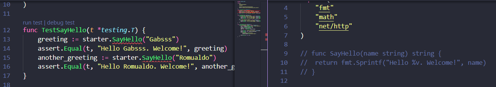
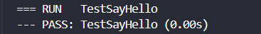
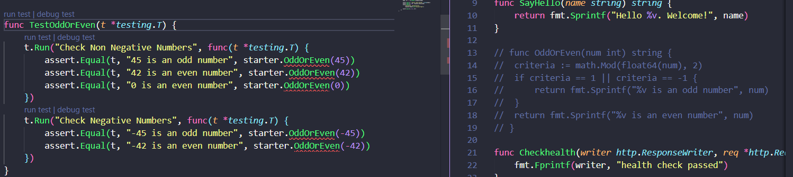
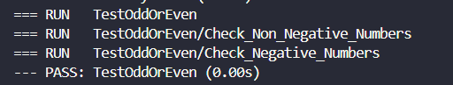
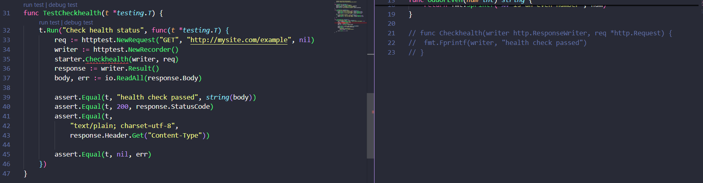
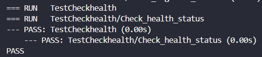

## Relatório: Aplicação do TDD no Desenvolvimento em Go

### **Introdução**

Este relatório resume a implementação do desenvolvimento orientado a testes (TDD) em Go, seguindo o tutorial "[Golang Testing with TDD](https://williaminfante.medium.com/golang-testing-with-tdd-e548d8be776)" de William Infante. O objetivo foi executar os exemplos e aprofundar o entendimento das técnicas de TDD.

### **O Ciclo TDD: Red, Green, Refactor**

1. **Red**: Escreve-se um teste para uma funcionalidade ainda não implementada. O teste falha, confirmando que algo precisa ser desenvolvido.

    **Exemplo**: Foram escritos testes como TestSayHello, TestOddOrEven e TestCheckhealth, que inicialmente falharam porque as funções sayHello, OddOrEven e Checkhealth ainda não estavam implementadas.

2. **Green**: Escreve-se o código mínimo para fazer o teste passar, focando apenas em satisfazer o teste.

    **Exemplo**: Implementação das funções sayHello, OddOrEven e Checkhealth para que seus testes passem.

3. **Refactor**: Com o teste passando, o código é refatorado para melhorar sua estrutura e eficiência, sem alterar seu comportamento.

    **Exemplo**: Depois de garantir que os testes passem, as funções implementadas são revisadas para melhorar sua clareza e eficiência.

### **Execução dos Testes**

#### **SayHello**
**Red**: Primeiro escrevemos o teste que falha pois não tem a função correspondente implementada.

**Green**: Depois implementamos a função correspondente e o teste passa com sucesso.

#### **OddOrEven**

**Red**: 

**Green**:

#### **Checkhealth**

**Red**: 

**Green**:

#### **Conclusão**

A prática do TDD neste projeto garantiu um desenvolvimento seguro e estruturado, onde cada funcionalidade foi testada e validada antes de ser integrada ao código principal.